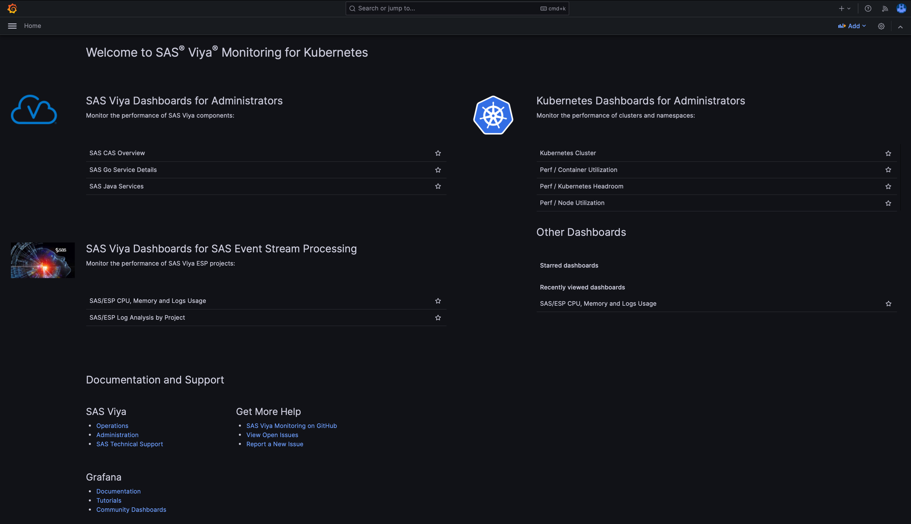
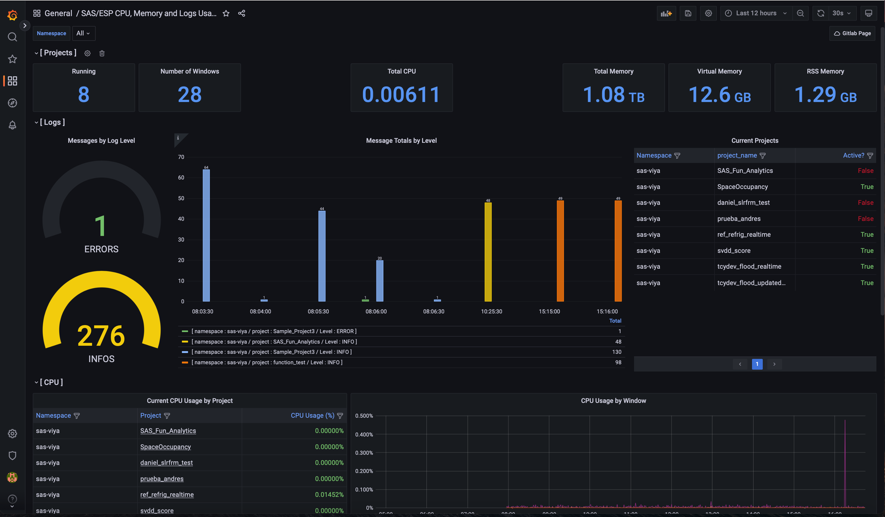
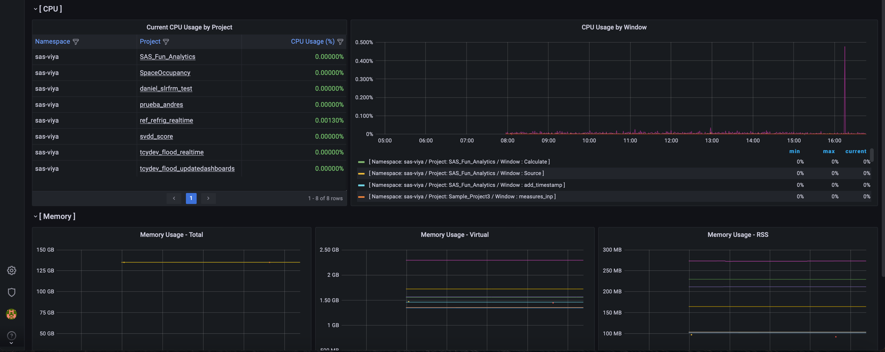
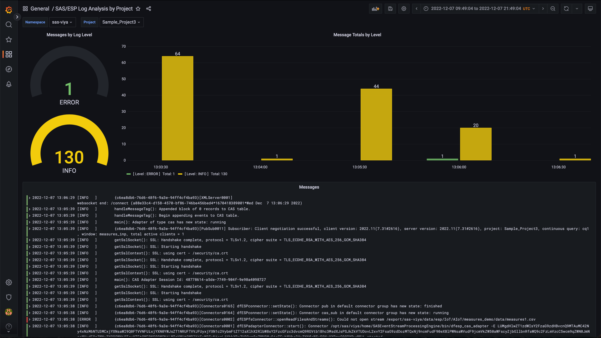
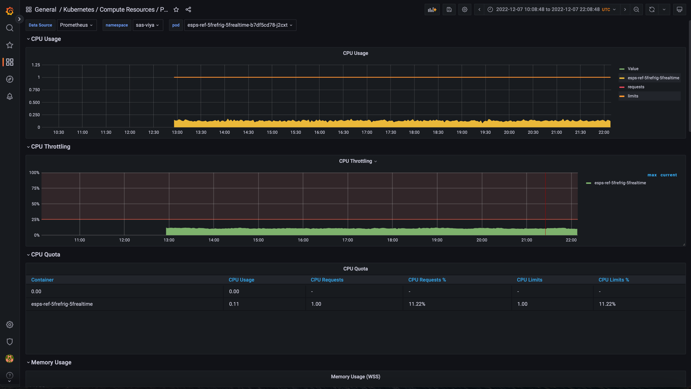

<a name="top"></a>


# <ins>_Monitoring SAS Event Stream Processing on Kubernetes</ins>_

_A tutorial on monitoring SAS Event Processing resources._

<table align="center"><tr><td align="center" width="9999">

</td></tr></table>

## Table of Contents

* [Overview](#overview)
* [Getting Started](#getting-started)
	* [Prerequisites](#prerequisites)
	* [Installation](#installation)
	* [Removal](#removal)
  	* [Accessing the Dashboards](#accessing-the-dashboards)
  	* [Deploying Custom Dashboards](#deploying-custom-dashboards)
	* [Troubleshooting](#troubleshooting)
* [Conclusion](#conclusion)
* [Contributing](#contributing)
* [License](#license)
* [Additional Resources](#additional-resources)

[&#11014;](#top) Top
## Overview

The current Viya 4 monitoring solution provides system administrators with a powerful tool to monitor installations as a whole. Resource oversight, coupled with the ability to aggregate log information and generate alerts make it easier to administer deployments regardless of their complexity. While this is helpful at a high level, within Viya, smaller ecosystems like the SAS Event Stream Processing (SAS ESP) require a more specialized approach to  both real time and historical monitoring of projects.

The monitoring stack for SAS ESP was developed to help customers address this need. It can be considered as an extended version of the [Viya 4 Monitoring](https://github.com/sassoftware/viya4-monitoring-kubernetes) solution, as it shares the same code base and allows for the installation of the same components in addition to the SAS ESP-specific ones. The main difference is that the SAS ESP stack doesn't require the deployment of the Viya 4 logging layer as it uses Loki instead for log aggregation.

A Grafana Lab product, Loki is a horizontally-scalable, highly-available, multi-tenant log aggregation system inspired by Prometheus, designed to be cost effective and easy to operate. Compared to other log aggregation systems, Loki:

```
- does not index the contents of the logs, but accesses log streams through a set of predefined or user-defined labels.
- indexes and groups log streams using the same labels as Prometheus, enabling users to seamlessly switch between metrics and logs.
- is an especially good fit for storing Kubernetes logs. Metadata labels are automatically scraped and indexed.
- has native support in Grafana, which means that Prometheus and Loki panels can coexist on the same dashboards.
```

A Loki-based stack consists of 3 components:

- Promtail, the agent responsible for gathering logs and sending them to Loki.
- The Loki server, responsible for storing logs and processing queries.
- Grafana, for querying and displaying the logs.

[&#11014;](#top) Top
## Getting Started

Before deploying the SAS ESP monitoring stack, make sure to review the list of pre-requisites, install any software that might be required, and customize configuration files as needed.

[&#11014;](#top) Top
### Prerequisites

The SAS ESP Monitoring stack can be deployed from Unix platforms only. The following prerequisites must be met before it can be used:

- The **kubectl** utility must be installed on the server where the monitoring stack will be installed;
- A local instance of **Helm** is required for the deployment of the monitoring components.
- The deployment includes:
```
        loki                            loki-simple-scalable-1.8.11             2.6.1
        promtail                        promtail-6.15.2                         2.9.1
        v4m-metrics                     v4m-1.2.7-SNAPSHOT                      1.2.7-SNAPSHOT
        v4m-prometheus-operator         kube-prometheus-stack-41.7.3            0.60.1
	
	[based on the current chart names and versions]
```

[&#11014;](#top) Top
### Installation
 
Download the tarred ZIP [<ins>file</ins>](Code/ESP_Monitoring.tar.gz) containing the SAS ESP monitoring stack on a Unix server, and unpack it in a folder of your choice using the following command:
```
tar -xzvf ESP_Monitor.tar.gz --dir=${HOME}
```
<details><summary><b><i>Click</i></b> to view the directory structure generated by the execution of the command:</summary>
<p>

```
Monitoring
├── customizations
│   └── monitoring
│       ├── dashboards
│       ├── loki
│       └── monitors
└── viya4-monitoring-kubernetes-main
    ├── bin
    ├── img
    ├── logging
    │   ├── bin
    │   ├── esexporter
    │   ├── eventrouter
    │   ├── fb
    │   ├── node-placement
    │   ├── opensearch
    │   │   ├── bin
    │   │   ├── rbac
    │   │   └── securityconfig
    │   ├── openshift
    │   ├── osd
    │   │   ├── cluster_admins
    │   │   ├── common
    │   │   ├── namespace
    │   │   └── tenant
    │   └── tls
    ├── monitoring
    │   ├── bin
    │   ├── dashboards
    │   │   ├── istio
    │   │   ├── kube
    │   │   ├── logging
    │   │   ├── nginx
    │   │   ├── pgmonitor
    │   │   │   └── disabled
    │   │   ├── rabbitmq
    │   │   ├── viya
    │   │   ├── viya-logs
    │   │   └── welcome
    │   ├── monitors
    │   │   ├── kube
    │   │   ├── logging
    │   │   └── viya
    │   ├── multitenant
    │   │   ├── dashboards
    │   │   ├── openshift
    │   │   └── tls
    │   ├── node-placement
    │   ├── openshift
    │   ├── rules
    │   │   └── viya
    │   └── tls
    ├── samples
    │   ├── azure-deployment
    │   │   ├── logging
    │   │   └── monitoring
    │   ├── azure-monitor
    │   ├── cloudwatch
    │   ├── external-alertmanager
    │   │   └── monitoring
    │   ├── generic-base
    │   │   ├── logging
    │   │   └── monitoring
    │   │       └── dashboards
    │   ├── gke-monitoring
    │   ├── ingress
    │   │   ├── host-based-ingress
    │   │   │   ├── logging
    │   │   │   └── monitoring
    │   │   └── path-based-ingress
    │   │       ├── logging
    │   │       └── monitoring
    │   ├── namespace-monitoring
    │   │   └── monitoring
    │   └── tls
    │       ├── host-based-ingress
    │       │   ├── logging
    │       │   └── monitoring
    │       └── path-based-ingress
    │           ├── logging
    │           └── monitoring
    ├── v4m-chart
    │   └── templates
    └── v4m-container
        ├── kubeconfig
        └── user_dir
```
Where:

- **customizations** is the folder that contains the Loki/Promtail artifacts, the sample Grafana dashboards for ESP, the Kubernetes ingress definitions for the monitoring components, and the **user.env** with custom install options settings:
	- **user.env** contains custom option settings for the deployment of the monitoring components. If necessary, review and modify the settings before deploying. A couple of considerations apply:
		- **LOKI_ENABLED** must be set to **True** for SAS ESP project logs to be monitored;
		- **LOKI_LOGFMT** must be set according to the format used by Kubernetes to write logs. As of the writing of this document, the format is **cri** for Azure, and **docker** for other providers like AWS.
	- **user-values-prom-operator-host/path-based.yaml.sample** contain sample settings for host or path-based access to the monitoring components. Path-based access is used for cloud-based deployments. When installing, copy the appropriate sample file to **user-values-prom-operator.yaml** in the same folder and customize it according to your needs.
	- **dashboards** contains the sample Grafana dashboards.
	- **loki** stores the artifacts used to install Loki/Promtail.
	- **monitors** contains the service monitor definition for Loki/Promtail.
- **viya4-monitoring-kubernetes-main** is the folder created by untarring the monitoring stack binaries. It contains configuration files and scripts for both the monitoring and logging components of Viya. The content of this folder should never be modified.

</p>
</details>

Proceed with the install as follows:

- Navigate to the "customization/monitoring" folder created by the unpacking of the binaries;
- Replace/update the content of the **user-values-prom-operator.yaml** file based on whether you need host or path-based ingresses for the monitoring components. The latter are normally used for cloud deployments;
- Review the content of the **user.env** file and customize it as needed. For a description of the options, please refer to the [Viya 4 Monitoring for Kubernetes](https://github.com/sassoftware/viya4-monitoring-kubernetes) page;
- Set the USER_DIR= environment variable to the full path of the **customization** folder and export it as shown in the following example:
```
  export USER_DIR=/root/Monitoring/customizations
```
- Navigate to the **<monitoring stack root folder>/viya4-monitoring-kubernetes-main/monitoring/bin** folder, and install the monitoring stack using the following command:
```
  ./deploy_monitoring_cluster
```

<details><summary><b><i>Click</i></b> to view the deploy_monitoring_cluster installation log:</summary>

\> User root   Host myserver   Current directory /root/Viya_Manager/Optional-Components/Monitoring/viya4-monitoring-kubernetes-main/monitoring/bin
export USER_DIR=/root/Viya_Manager/Optional-Components/Monitoring/customizations

\> User root   Host myserver   Current directory /root/Viya_Manager/Optional-Components/Monitoring/viya4-monitoring-kubernetes-main/monitoring/bin
\> ./deploy_monitoring_cluster.sh\
INFO User directory: /root/Viya_Manager/Optional-Components/Monitoring/customizations\
INFO Helm client version: 3.7.1\
INFO Kubernetes client version: v1.23.8\
INFO Kubernetes server version: v1.23.8\
INFO Loading user environment file: /root/Viya_Manager/Optional-Components/Monitoring/customizations/monitoring/user.env

namespace/monitoring created\
Deploying monitoring to the [monitoring] namespace...\
"prometheus-community" already exists with the same configuration, skipping\
Hang tight while we grab the latest from your chart repositories...\
...Successfully got an update from the "nfs" chart repository\
...Successfully got an update from the "opensearch" chart repository\
...Successfully got an update from the "fluent" chart repository\
...Successfully got an update from the "jetstack" chart repository\
...Successfully got an update from the "jupyterhub" chart repository\
...Successfully got an update from the "gitlab" chart repository\
...Successfully got an update from the "grafana" chart repository\
...Successfully got an update from the "prometheus-community" chart repository\
...Successfully got an update from the "nginx" chart repository\
Update Complete. ⎈Happy Helming!⎈\
INFO Updating Prometheus Operator custom resource definitions\
customresourcedefinition.apiextensions.k8s.io/alertmanagerconfigs.monitoring.coreos.com replaced\
customresourcedefinition.apiextensions.k8s.io/alertmanagers.monitoring.coreos.com replaced\
customresourcedefinition.apiextensions.k8s.io/prometheuses.monitoring.coreos.com replaced\
customresourcedefinition.apiextensions.k8s.io/prometheusrules.monitoring.coreos.com replaced\
customresourcedefinition.apiextensions.k8s.io/podmonitors.monitoring.coreos.com replaced\
customresourcedefinition.apiextensions.k8s.io/servicemonitors.monitoring.coreos.com replaced\
customresourcedefinition.apiextensions.k8s.io/thanosrulers.monitoring.coreos.com replaced\
customresourcedefinition.apiextensions.k8s.io/probes.monitoring.coreos.com replaced\
No resources found\
INFO Enabling monitoring components for workload node placement\
INFO User response file: [/root/Viya_Manager/Optional-Components/Monitoring/customizations/monitoring/user-values-prom-operator.yaml]\
INFO Deploying the kube-prometheus stack. This may take a few minutes ...\
INFO Installing via Helm (Wed Dec 7 12:53:50 UTC 2022 - timeout 20m)\
Release "v4m-prometheus-operator" does not exist. Installing it now.\
NAME: v4m-prometheus-operator\
LAST DEPLOYED: Wed Dec  7 12:53:53 2022\
NAMESPACE: monitoring\
STATUS: deployed\
REVISION: 1\
NOTES:\
kube-prometheus-stack has been installed. Check its status by running:\
  kubectl --namespace monitoring get pods -l "release=v4m-prometheus-operator"

Visit https://github.com/prometheus-operator/kube-prometheus for instructions on how to create & configure Alertmanager and Prometheus instances using the Operator.\
"grafana" already exists with the same configuration, skipping\
Hang tight while we grab the latest from your chart repositories...\
...Successfully got an update from the "nfs" chart repository\
...Successfully got an update from the "opensearch" chart repository\
...Successfully got an update from the "fluent" chart repository\
...Successfully got an update from the "jetstack" chart repository\
...Successfully got an update from the "gitlab" chart repository\
...Successfully got an update from the "jupyterhub" chart repository\
...Successfully got an update from the "grafana" chart repository\
...Successfully got an update from the "prometheus-community" chart repository\
...Successfully got an update from the "nginx" chart repository\
Update Complete. ⎈Happy Helming!⎈\
Release "loki" does not exist. Installing it now.\
NAME: loki\
LAST DEPLOYED: Wed Dec  7 12:54:37 2022\
NAMESPACE: monitoring\
STATUS: deployed\
REVISION: 1\
NOTES:\
***********************************************************************\
 Welcome to Grafana Loki\
 Chart version: 1.8.11\
 Loki version: 2.6.1\
***********************************************************************

Installed components:
* gateway
* read
* write


This chart requires persistence and object storage to work correctly.\
Queries will not work unless you provide a `loki.config.common.storage` section with\
a valid object storage (and the default `filesystem` storage set to `null`), as well\
as a valid `loki.config.schema_config.configs` with an `object_store` that\
matches the common storage section.

For example, to use MinIO as your object storage backend:

loki:\
  config:\
    common:\
      storage:\
        filesystem: null\
        s3:\
          endpoint: minio.minio.svc.cluster.local:9000\
          insecure: true\
          bucketnames: loki-data\
          access_key_id: loki\
          secret_access_key: supersecret\
          s3forcepathstyle: true\
    schema_config:\
      configs:\
        - from: "2020-09-07"\
          store: boltdb-shipper\
          object_store: s3\
          schema: v11\
          index:\
            period: 24h\
            prefix: loki_index_\
Release "promtail" does not exist. Installing it now.\
NAME: promtail\
LAST DEPLOYED: Wed Dec  7 12:55:02 2022\
NAMESPACE: monitoring\
STATUS: deployed\
REVISION: 1\
TEST SUITE: None\
NOTES:
***********************************************************************\
 Welcome to Grafana Promtail\
 Chart version: 6.7.1\
 Promtail version: 2.7.0
***********************************************************************

Verify the application is working by running these commands:
* kubectl --namespace monitoring port-forward daemonset/promtail 3101
* curl http://127.0.0.1:3101/metrics\
configmap/promtail created\
daemonset.apps "promtail" deleted\
daemonset.apps/promtail created\
service/promtail created\
INFO Deploying ServiceMonitors and Prometheus rules\
INFO Deploying cluster ServiceMonitors\
NAME            STATUS   AGE\
ingress-nginx   Active   48d\
INFO NGINX found. Deploying podMonitor to [ingress-nginx] namespace\
podmonitor.monitoring.coreos.com/ingress-nginx configured\
podmonitor.monitoring.coreos.com/eventrouter created\
servicemonitor.monitoring.coreos.com/elasticsearch created\
servicemonitor.monitoring.coreos.com/fluent-bit created\
servicemonitor.monitoring.coreos.com/fluent-bit-v2 created\
INFO Deploying user ServiceMonitors\
INFO Deploying user ServiceMonitors from [/root/Viya_Manager/Optional-Components/Monitoring/customizations/monitoring/monitors] ...\
servicemonitor.monitoring.coreos.com/sas-esp-server created\
INFO Adding Prometheus recording rules\
prometheusrule.monitoring.coreos.com/sas-launcher-job-rules created\
NAME                  AGE\
v4m-kubernetes-apps   71s\
INFO Patching KubeHpaMaxedOut rule\
prometheusrule.monitoring.coreos.com/v4m-kubernetes-apps patched\
INFO Provisioning Loki datasource for Grafana\
secret/grafana-datasource-loki created\
secret/grafana-datasource-loki labeled

INFO Deploying dashboards to the [monitoring] namespace ...\
INFO Deploying welcome dashboards\
configmap/viya-welcome-dashboard created\
configmap/viya-welcome-dashboard labeled\
INFO Deploying Kubernetes cluster dashboards\
configmap/k8s-cluster-dashboard created\
configmap/k8s-cluster-dashboard labeled\
configmap/k8s-deployment-dashboard created\
configmap/k8s-deployment-dashboard labeled\
configmap/perf-k8s-container-util created\
configmap/perf-k8s-container-util labeled\
configmap/perf-k8s-headroom created\
configmap/perf-k8s-headroom labeled\
configmap/perf-k8s-node-util-detail created\
configmap/perf-k8s-node-util-detail labeled\
configmap/perf-k8s-node-util created\
configmap/perf-k8s-node-util labeled\
configmap/prometheus-alerts created\
configmap/prometheus-alerts labeled\
INFO Deploying Logging dashboards\
configmap/elasticsearch-dashboard created\
configmap/elasticsearch-dashboard labeled\
configmap/fluent-bit created\
configmap/fluent-bit labeled\
INFO Deploying SAS Viya dashboards\
configmap/cas-dashboard created\
configmap/cas-dashboard labeled\
configmap/go-service-dashboard created\
configmap/go-service-dashboard labeled\
configmap/java-service-dashboard created\
configmap/java-service-dashboard labeled\
configmap/postgres-dashboard created\
configmap/postgres-dashboard labeled\
configmap/sas-launched-jobs-node created\
configmap/sas-launched-jobs-node labeled\
configmap/sas-launched-jobs-users created\
configmap/sas-launched-jobs-users labeled\
INFO Deploying Postgres dashboards\
configmap/pg-details created\
configmap/pg-details labeled\
INFO Deploying RabbitMQ dashboards\
configmap/erlang-memory-allocators created\
configmap/erlang-memory-allocators labeled\
configmap/rabbitmq-overview created\
configmap/rabbitmq-overview labeled\
INFO Deploying NGINX dashboards\
configmap/nginx-dashboard created\
configmap/nginx-dashboard labeled\
INFO Deploying user dashboards from [/root/Viya_Manager/Optional-Components/Monitoring/customizations/monitoring/dashboards]\
configmap/cpu-memory-and-logs-usage created\
configmap/cpu-memory-and-logs-usage labeled\
configmap/log-analysis-by-project created\
configmap/log-analysis-by-project labeled\
configmap/viya-welcome-dashboard configured\
configmap/viya-welcome-dashboard unlabeled\
INFO Deployed dashboards to the [monitoring] namespace\
INFO Updating Viya Monitoring for Kubernetes version information\
Release "v4m-metrics" does not exist. Installing it now.\
NAME: v4m-metrics\
LAST DEPLOYED: Wed Dec  7 12:55:32 2022\
NAMESPACE: monitoring\
STATUS: deployed\
REVISION: 1\
TEST SUITE: None\
NOTES:\
Viya Monitoring for Kubernetes 1.2.7-SNAPSHOT is installed

GRAFANA:\
  http://iot.viya-azure-3.unx.sas.com/grafana

 Successfully deployed components to the [monitoring] namespace

</p>
</details>

- Optionally, perform the following steps to deploy the Viya 4 dashboards:
```
User root   Host myserver   Current directory /root/Viya_Manager/Optional-Components/Monitoring/viya4-monitoring-kubernetes-main/monitoring/bin
> export VIYA_NS=sas-viya <-- Replace as needed with the name of the Viya namespace

User root   Host myserver   Current directory /root/Viya_Manager/Optional-Components/Monitoring/viya4-monitoring-kubernetes-main/monitoring/bin
> ./deploy_monitoring_viya.sh
```
<details><summary><b><i>Click</i></b> to view the deploy_monitoring_viya installation log:</summary>
<p>
INFO User directory: /root/Viya_Manager/Optional-Components/Monitoring/customizations\
INFO Helm client version: 3.7.1\
INFO Kubernetes client version: v1.23.8\
INFO Kubernetes server version: v1.23.8\
INFO Loading user environment file: /root/Viya_Manager/Optional-Components/Monitoring/customizations/monitoring/user.env

"prometheus-community" already exists with the same configuration, skipping\
INFO Updating helm repositories...\
Hang tight while we grab the latest from your chart repositories...\
...Successfully got an update from the "nfs" chart repository\
...Successfully got an update from the "opensearch" chart repository\
...Successfully got an update from the "fluent" chart repository\
...Successfully got an update from the "jetstack" chart repository\
...Successfully got an update from the "gitlab" chart repository\
...Successfully got an update from the "jupyterhub" chart repository\
...Successfully got an update from the "grafana" chart repository\
...Successfully got an update from the "prometheus-community" chart repository\
...Successfully got an update from the "nginx" chart repository\
Update Complete. ⎈Happy Helming!⎈\
INFO Enabling monitoring components for workload node placement\
Enabling the [sas-viya] namespace for SAS Viya monitoring\
INFO Installing the Prometheus Pushgateway to the [sas-viya] namespace\
Release "prometheus-pushgateway" has been upgraded. Happy Helming!\
NAME: prometheus-pushgateway\
LAST DEPLOYED: Wed Dec  7 21:05:21 2022\
NAMESPACE: sas-viya\
STATUS: deployed\
REVISION: 3\
TEST SUITE: None\
NOTES:\
1. Get the application URL by running these commands:\
  export POD_NAME=$(kubectl get pods --namespace sas-viya -l "app=prometheus-pushgateway,release=prometheus-pushgateway" -o jsonpath="{.items[0].metadata.name}")\
  echo "Visit http://127.0.0.1:8080 to use your application"\
  kubectl port-forward $POD_NAME 8080:80\
INFO Adding monitors for resources in the [sas-viya] namespace...\
servicemonitor.monitoring.coreos.com/sas-arke configured\
servicemonitor.monitoring.coreos.com/sas-cas-operator configured\
servicemonitor.monitoring.coreos.com/sas-cas-server configured\
servicemonitor.monitoring.coreos.com/sas-elasticsearch configured\
servicemonitor.monitoring.coreos.com/sas-opendistro unchanged\
servicemonitor.monitoring.coreos.com/sas-postgres configured\
servicemonitor.monitoring.coreos.com/pushgateway unchanged\
servicemonitor.monitoring.coreos.com/sas-rabbitmq-server configured\
podmonitor.monitoring.coreos.com/sas-deployment-operator configured\
podmonitor.monitoring.coreos.com/sas-go-pods configured\
podmonitor.monitoring.coreos.com/sas-java-pods configured\
Monitoring components successfully deployed into the [sas-viya] namespace
	
</p>
</details>

For more information on the installation of the Viya 4 monitoring layer as well as on the optional logging component for non-SAS ESP logs, please refer to the [Viya 4 Monitoring for Kubernetes](https://github.com/sassoftware/viya4-monitoring-kubernetes) GitHub page.


[&#11014;](#top) Top
### Removal
 
Removal of the SAS ESP Monitoring stack is performed in the same exact way as with the Viya 4 Monitoring stack:

```
User root   Host myserver   Current directory /root/Viya_Manager/Optional-Components/Monitoring/viya4-monitoring-kubernetes-main/monitoring/bin
> export USER_DIR=/root/Viya_Manager/Optional-Components/Monitoring/customizations

User root   Host myserver   Current directory /root/Viya_Manager/Optional-Components/Monitoring/viya4-monitoring-kubernetes-main/monitoring/bin
> ./remove_monitoring_cluster.sh
```
<details><summary><b><i>Click</i></b> to view the log generated by the remove_monitoring_cluster.sh command:</summary>
<p>

\> ./remove_monitoring_cluster.sh\
INFO User directory: /root/Viya_Manager/Optional-Components/Monitoring/customizations\
INFO Helm client version: 3.7.1\
INFO Kubernetes client version: v1.23.8\
INFO Kubernetes server version: v1.23.8\
INFO Loading user environment file: /root/Viya_Manager/Optional-Components/Monitoring/customizations/monitoring/user.env

Removing components from the [monitoring] namespace...\
INFO Removing the kube-prometheus stack...\
release "v4m-prometheus-operator" uninstalled\
release "loki" uninstalled\
INFO Removing Promtail cluster binding role...\
clusterrolebinding.rbac.authorization.k8s.io "promtail" deleted\
INFO Removing Promtail cluster role...\
clusterrole.rbac.authorization.k8s.io "promtail" deleted\
INFO Removing v4m-kubelet service\
service "v4m-kubelet" deleted\
INFO Deleting the [monitoring] namespace...\
namespace "monitoring" deleted\
INFO [monitoring] namespace deleted successfully
	
</p>
</details>
	
[&#11014;](#top) Top
### Accessing the Dashboards
 
Grafana can be accessed using the link displayed at the bottom of the installation log. The password for the **admin** user can either be provided in the **user.env** file in the **$USER_DIR** folder (recommended), or set after the install by running the **change_grafana_admin_password.sh** script located in **<monitoring stack root folder>/viya4-monitoring-kubernetes-main/monitoring/bin** directory.

The Viya Welcome dashboard is displayed upon logging in:

<table align="center"><tr><td align="center" width="9999">

</td></tr></table>

Selecting the **SAS ESP CPU, Memory, and Logs Usage** dashboard will show something similar to this:

<table align="center"><tr><td align="center" width="9999">


</td></tr></table>

In addition to CPU and Memory metrics, the dashboard shows logs aggregation information, both summarily and at the individual project level. The cumulative numbers shown in the **Message Totals by Level** panel apply to all projects active within the chosen time interval, whereas the **Current Projects** panel gives access to log information only for currently active projects. Selecting log information displays a screen similar to the following:

<table align="center"><tr><td align="center" width="9999">

</td></tr></table>

On the **SAS ESP CPU, Memory, and Logs Usage** dashboard, the **Current CPU Usage By Project** panel on the left side of the screen offers the ability to drill down to the individual pod level to access additional metrics. For example:

<table align="center"><tr><td align="center" width="9999">

</td></tr></table>

[&#11014;](#top) Top
### Deploying Custom Dashboards
 
The dashboards installed with the SAS ESP Monitoring stack are meant to be used as an example of the kind of monitoring that can be done through Grafana. Since the dashboards are provisioned as part of the installation, they cannot be modified directly in Grafana. Therefore it is recommended to either change their source code, or to create copies to work on. They can be cloned and modified to create even more sophisticated dashboards to, for instance, target different metrics or trigger alerts. The source code for the sample dashboards can be found in the **$USER_DIR/monitoring/dashboards** folder. Whether you decide to modify the existing dashboard or create new ones in the same folder, they can be deploy into an existing stack by running the following commands:
```
User root   Host myserver   Current directory /root/Viya_Manager/Optional-Components/Monitoring/viya4-monitoring-kubernetes-main/monitoring/bin
> export USER_DIR=/root/Viya_Manager/Optional-Components/Monitoring/customizations

User root   Host myserver   Current directory /root/Viya_Manager/Optional-Components/Monitoring/viya4-monitoring-kubernetes-main/monitoring/bin
> ./deploy_dashboards.sh
```
<details><summary><b><i>Click</i></b> to view the log generated by the deploy_dashboards.sh command:</summary>
<p>

\> ./deploy_dashboards.sh\
INFO User directory: /root/Viya_Manager/Optional-Components/Monitoring/customizations\
INFO Helm client version: 3.7.1\
INFO Kubernetes client version: v1.23.8\
INFO Kubernetes server version: v1.23.8\
INFO Loading user environment file: /root/Viya_Manager/Optional-Components/Monitoring/customizations/monitoring/user.env

INFO Deploying dashboards to the [monitoring] namespace ...\
INFO Deploying welcome dashboards\
configmap/viya-welcome-dashboard configured\
configmap/viya-welcome-dashboard labeled\
INFO Deploying Kubernetes cluster dashboards\
configmap/k8s-cluster-dashboard configured\
configmap/k8s-cluster-dashboard not labeled\
configmap/k8s-deployment-dashboard configured\
configmap/k8s-deployment-dashboard not labeled\
configmap/perf-k8s-container-util configured\
configmap/perf-k8s-container-util not labeled\
configmap/perf-k8s-headroom configured\
configmap/perf-k8s-headroom not labeled\
configmap/perf-k8s-node-util-detail configured\
configmap/perf-k8s-node-util-detail not labeled\
configmap/perf-k8s-node-util configured\
configmap/perf-k8s-node-util not labeled\
configmap/prometheus-alerts configured\
configmap/prometheus-alerts not labeled\
INFO Deploying Logging dashboards\
configmap/elasticsearch-dashboard configured\
configmap/fluent-bit not labeled\
INFO Deploying SAS Viya dashboards\
configmap/cas-dashboard configured\
configmap/cas-dashboard not labeled\
configmap/go-service-dashboard configured\
configmap/go-service-dashboard not labeled\
configmap/java-service-dashboard configured\
configmap/java-service-dashboard not labeled\
configmap/postgres-dashboard configured\
configmap/postgres-dashboard not labeled\
configmap/sas-launched-jobs-node configured\
configmap/sas-launched-jobs-node not labeled\
configmap/sas-launched-jobs-users configured\
configmap/sas-launched-jobs-users not labeled\
INFO Deploying Postgres dashboards\
configmap/pg-details configured\
configmap/pg-details not labeled\
INFO Deploying RabbitMQ dashboards\
configmap/erlang-memory-allocators configured\
configmap/erlang-memory-allocators not labeled\
configmap/rabbitmq-overview configured\
configmap/rabbitmq-overview not labeled\
INFO Deploying NGINX dashboards\
configmap/nginx-dashboard configured\
configmap/nginx-dashboard not labeled\
INFO Deploying user dashboards from [/root/Viya_Manager/Optional-Components/Monitoring/customizations/monitoring/dashboards]\
configmap/cpu-memory-and-logs-usage configured\
configmap/cpu-memory-and-logs-usage not labeled\
configmap/log-analysis-by-project configured\
configmap/log-analysis-by-project not labeled\
configmap/viya-welcome-dashboard configured\
configmap/viya-welcome-dashboard unlabeled\
INFO Deployed dashboards to the [monitoring] namespace

</p>
</details>	

Alternatively, dashboards can be created or cloned in Grafana, with no deployment needed once the dashboards are ready. Either way, it is recommended to consult the Grafana documentation for best practices on how to develop dashboards.

[&#11014;](#top) Top
### Troubleshooting

For the SAS ESP Monitoring stack to install without errors, the entire list of prerequisites must be satisfied. Make sure to go through each one of them before attempting to deploy. Once the requirements are in place, in the event any of the deployment tasks fail, it is recommended to remove the software before attemping execution again. To troubleshoot problems with the Kubernetes cluster, it is recommended that you use a tool like Lens, or ask someone to help you do the same if you are not familiar with Kubernetes. Finally, always consult the documentaion for the Viya 4 Monitoring solution before applying any configuration changes that could lead to deployment errors.

[&#11014;](#top) Top
## Conclusion

Ad-hoc monitoring of Viya 4 SAS ESP resources can be tedious and time consuming. This tutorial shows how this task can be eased through the installation of the SAS ESP Monitoring stack, an add-on to the Viya 4 Monitoring solution SAS provides for the monitoring of the whole Viya system. The SAS ESP stack gives system administrators metrics to accurately measure CPU usage and memory consumption. Real-time and historical log information is also made available at the individual project level to help debug any issues a project might encounter during its execution. The result is a faster monitoring of SAS ESP resources to help troubleshoot issues before they reach the potential to negatively affect the overall performance of the environment.

[&#11014;](#top) Top
## Contributing

This project does not accept contributions.

[&#11014;](#top) Top
## License

This project uses the SAS License Agreement for Corrective Code or Additional Functionality.  Please see license file for additional detail.

[&#11014;](#top) Top
## Additional Resources

* [SAS ESP Monitoring Events, Alerts, and Health Documentation](https://go.documentation.sas.com/doc/en/espcdc/v_030/espex/p0rwojd7hnzcymn117e1ilapqgqm.htm)
* [SAS Viya 4 Monitorng for Kubernetes](https://github.com/sassoftware/viya4-monitoring-kubernetes)
* [Prometheus](https://prometheus.io/)
* [Grafana](https://grafana.com/)
* [Grafana Loki](https://grafana.com/oss/loki/#:~:text=Loki%20is%20a%20horizontally%20scalable,labels%20for%20each%20log%20stream.)
