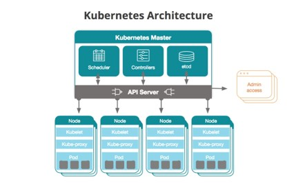
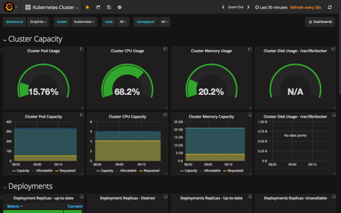

# Set Up a Kubernetes Monitoring Stack for SAS Event Stream Processing on Kubernetes
 
## Table of Contents

* [Overview](#overview)
* [Kubernetes Overview](#kubernetes-overview)
	* [Master Components](#master-components)
		* [kube-apiserver](#kube-apiserver)
		* [etcd](#etcd)
		* [kube-scheduler](#kube-scheduler)
		* [kube-controller-manager](#kube-controller-manager)
		* [cloud-controller-manager](#cloud-controller-manager)
	* [Node Components](#node-components)
		* [kubelet](#kubelet)
		* [kube-proxy](#kube-proxy)
		* [Container Runtime](#container-runtime)
* [What to Monitor](#what-to-monitor)
	* [Kubernetes Cluster](#kubernetes-cluster)
	* [Pods](#pods)
* [Monitoring Options](#monitoring-options)
	* [DaemonSets](#daemonsets)
	* [Prometheus](#prometheus)
* [Operators](#operators)
	* [Kubernetes Operator](#kubernetes-operator)
	* [Prometheus Operator](#prometheus-operator)
		* [Helm](#helm)
* [How to Monitor](#how-to-monitor)
	* [Prometheus exporters](#prometheus-exporters)
	* [Grafana](#grafana)
	* [Loki](#loki)
	* [SAS Event Stream Processing and Prometheus](#sas-event-stream-processing-and-prometheus)
* [Contributing](#contributing)
* [License](#license)

## Overview

[Prometheus](https://prometheus.io/) is quickly becoming the de-facto monitoring tool for Kubernetes, in part because of the simplicity of its installation and configuration
processes, but also because of the integration with Grafana, an open source visualization and analytics software that allows you to query, visualize,
alert on, and explore metrics no matter where they are stored.

SAS exposes metrics for metering as well as for ESP servers in a Prometheus-ready format. Such metrics can be grouped in two distinct families, one
related to CPU usage, the other to memory consumption. The former allows administrators to monitor CPU at the project window level, while the latter
reports on memory consumption based on type (total, virtual, or Resident Set Size).

The documents found in this project provides a high-level introduction to Prometheus and [Grafana](https://grafana.com/), as well as a description of the steps required to
set up a monitoring stack for a Kubernetes cluster that is running the SAS ESP operator. The goal is to make the whole deployment easy to understand
and perform, while ultimately providing the ability to monitor resources with the goal of minimizing performance degradation. 

To get more details about these and many other new features we invite you to look at each document. A [ZIP](Monitoring.zip) file is also attached containing 
the macro code, a file showing sample invocations covering different scenarios, as well as the Job Definition and Job Form files that are needed in 
case you want to invoke the macro directly from your Web Browser.

## Kubernetes Overview

Kubernetes (also referred to as “k8s” or “k-eights”) is an open-source software that allows you to manage (orchestrate) containers at scale. Kubernetes are deployed as clusters. Normally, a cluster has one master and one or more worker nodes. The worker node(s) host the Pods that are the components of the application workload. The control plane manages the worker nodes and the Pods in the cluster. In production environments, the control plane usually runs across multiple computers and a cluster usually runs multiple nodes, providing fault-tolerance and high availability.

*Figure 1 - Kubernetes Architecture*

### Master Components

The control plane’s components make global decisions about the cluster (e.g., scheduling), as well as detecting and responding to cluster events (e.g., starting up a new pod). Control plane components can be run on any machine in the cluster. However, for simplicity, set up scripts typically start all control plane components on the same machine, and do not run user containers on this machine.

#### kube-apiserver

The API server is a component of the Kubernetes control plane that exposes the Kubernetes API. The API server is the front end for the Kubernetes control plane. The main implementation of a Kubernetes API server is kube-apiserver. kube-apiserver is designed to scale horizontally—that is, it scales by deploying more instances. You can run several instances of kube-apiserver and balance traffic between those instances.

#### etcd

Consistent and highly-available key value store used as Kubernetes’ backing store for all cluster data. If your Kubernetes cluster uses etcd as its backing store, make sure you have a back up plan for those data.

#### kube-scheduler

Control plane component that watches for newly created Pods with no assigned node, and selects a node for them to run on. Factors taken into account for scheduling decisions include: individual and collective resource 	requirements, hardware/software/policy constraints, affinity and anti-affinity specifications, data locality, inter-workload interference, and deadlines.

#### kube-controller-manager

Control Plane component that runs controller processes. Logically, each controller is a separate process, but to reduce complexity, they are all compiled into a single binary and run in a single process.

These controllers include:

- **Node controller**: Responsible for noticing and responding when nodes go down.
- **Replication controller**: Responsible for maintaining the correct number of pods for every replication controller object in the system.
- **Endpoints controller**: Populates the Endpoints object (that is, joins Services & Pods).
- **Service Account & Token controllers**: Create default accounts and API access tokens for new namespaces.

#### cloud-controller-manager

A Kubernetes control plane component that embeds cloud-specific control logic. The cloud controller manager lets you link your cluster into your cloud provider’s API, and separates out the components that interact with 	that cloud platform from components that just interact with your cluster. The cloud-controller-manager only runs controllers that are specific to your cloud provider. If you are running Kubernetes on your own premises, or in a learning environment inside your own PC, the cluster does not have a cloud controller manager. As with the kube-controller-manager, the cloud-controller-manager combines several logically independent control loops into a single binary that you run as a single process. You can scale horizontally (run more than one copy) to improve performance or to help tolerate failures.

The following controllers can have cloud provider dependencies:

- **Node controller**: For checking the cloud provider to determine if a node has been deleted in the cloud after it stops responding
- **Route controller**: For setting up routes in the underlying cloud infrastructure
- **Service controller**: For creating, updating and deleting cloud provider load balancers

### Node Components

Node components run on every node, maintaining running pods and providing the Kubernetes runtime environment.

#### kubelet

An agent that runs on each node in the cluster. It makes sure that containers are running in a Pod. The kubelet takes a set of PodSpecs that are provided through various mechanisms and ensures that the containers described in those PodSpecs are running and healthy. The kubelet doesn’t manage containers which were not created by Kubernetes.

#### kube-proxy

kube-proxy is a network proxy that runs on each node in your cluster, implementing part of the Kubernetes Service concept. kube-proxy maintains network rules on nodes. These network rules allow network communication to your Pods from network sessions inside or outside of your cluster. kube-proxy uses the operating system packet filtering layer if there is one and it’s available. Otherwise, kube-proxy forwards the traffic itself.

#### Container Runtime

The container runtime is the software that is responsible for running containers. Kubernetes supports several container runtimes: Docker, containerd, CRI-O, and any implementation of the Kubernetes CRI (Container Runtime Interface).

With Kubernetes, applications are developed to run in containers, which represent the technology used to pack together applications with their configurations and dependencies to decouple them from any underlying host infrastructure

Containers are grouped into pods, the basic operational unit for Kubernetes. Pods contain one or more containers which are administered as a single entity

Pods are logically grouped into namespaces, whose scope is to isolate applications from one another. Namespaces can be seen as virtual machines, in that they can be independently set, administered and run

## What to Monitor

You can monitor Kubernetes clusters or pods.

### Kubernetes Cluster

When you monitor a Kubernetes cluster, the objective is to monitor the health of the entire cluster through metrics such as:

- Node resource utilization, as in network bandwidth, disk utilization, CPU, and memory utilization. Using these metrics, one can find out whether to increase or decrease the number and size of nodes in the cluster
- Number of nodes, to help figure out what you are paying for (if you are using cloud providers), and to discover what the cluster is being used for
- Running pods, to help determine if the number of nodes available is enough to handle the current workload, and any unexpected failures

*Figure 2 - Cluster Monitoring*

### Pods

There are three major categories of metrics when monitoring pods:

- Kubernetes metrics, to monitor how a specific pod and its deployment are being handled by the orchestrator
- Pod & container metrics, such as CPU, network, and memory usage compared with the maximum allowed
- Application metrics, developed by the application itself and generally related to the business rules it addresses

## Monitoring Options

You can monitor a cluster or pod using Kubernetes DaemonSetsor through the use of a monitoring tool like Prometheus or Fluentd.

### DaemonSets

One approach to monitoring all cluster nodes is to create a special kind of Kubernetes pod called DaemonSets. Kubernetes ensures that every node created has a copy of the DaemonSet pod, which virtually enables one deployment to watch each machine in the cluster. As nodes are destroyed, the pod is also terminated. Many monitoring solutions use the Kubernetes DaemonSet structure to deploy an agent on every cluster node. In this case, there is not a general solution as each tool will have its own software for cluster monitoring.

### Prometheus

Prometheus has emerged as the de-facto open source standard for monitoring Kubernetes. Real-time metrics are collected and stored in a time-series database that cam be queried using an SQL-based language. Additional plug-ins such as alert management and data exporters available.

Prometheus runs on top of Kubernetes via the Prometheus Operator and is integrated with Grafana. Grafana is open source visualization and analytics software. It allows you to query, visualize, alert on, and explore your metrics no matter where they are stored. It provides you with tools to turn your time-series database (TSDB) data into beautiful graphs and visualizations.

## Operators

### Kubernetes Operator

Operators are Kubernetes-specific applications (pods) that configure, manage and optimize other Kubernetes deployments automatically. They are implemented as a custom controller. A Kubernetes operator encapsulates the know-how of deploying and scaling an application and directly executes algorithm decisions communicating with the API. A Kubernetes Operator might be able to:

- Install and provide sane initial configuration and sizing for your deployment, according to the specs of your Kubernetes cluster.
- Perform live reloading of deployments and pods to accommodate for any user-requested parameter modification (hot config reloading).
- Automatically scale up or down according to performance metrics.
- Perform backups, integrity checks or any other maintenance task.
- Basically, anything that can be expressed as code by a human admin can be automated inside a Kubernetes Operator.

Kubernetes Operators make extensive use of Custom Resource Definitions (or CRDs) to create context-specific entities and objects that will be accessed like any other Kubernetes API resource. Operators read, write and update CRDs to persist service configuration inside the cluster.

### Prometheus Operator

The Prometheus Operator for Kubernetes provides easy monitoring definitions for Kubernetes services and deployment and management of Prometheus instances. We are going to use the Prometheus Operator to:

- Perform the initial installation and configuration of the full Kubernetes-Prometheus stack
    - Prometheus servers
    - Alertmanager
    - Grafana
    - Host node_exporter
    - kube-state-metrics
- Define metric endpoint autoconfiguration using the ServiceMonitor entities
- Customize and scale the services using the Operator CRDs and ConfigMaps, making our configuration fully portable and declarative

The Operator acts on the following custom resource definitions (CRDs):

- **Prometheus**, which defines the desired Prometheus deployment. The Operator ensures at all times that a deployment matching the resource definition is running.
- **ServiceMonitor**, which declaratively specifies how groups of services should be monitored. The Operator automatically generates Prometheus scrape configuration based on the definition.
- **PrometheusRule**, which defines a desired Prometheus rule file, which can be loaded by a Prometheus instance containing Prometheus alerting and recording rules.
- **Alertmanager**, which defines a desired Alertmanager deployment. The Operator ensures at all times that a deployment matching the resource definition is running.

The kube-prometheus directory inside the Operator repository contains default services and configurations, so you get not only the Prometheus Operator itself, but a complete setup that you can start using and customizing from the get-go.

Starting with Viya 4, the Prometheus Operator can be deployed as part of the installation, which makes the overall implementation of the monitoring stack much faster.

#### Helm

Helm is a package manager that provides an easy way to find, share, and use software built for Kubernetes. The project uses a packaging format called charts, which are a collection of files that describe a related set of Kubernetes resources. It is used in production by a variety of organizations, including AT&T, Bitnami, CERN, Conde Nast, Microsoft, VMWare, and many others. Since its inception, there have been more than 13,000 contributions representing over 1,500 companies to the Helm project. Helm was created in 2015 at Deis, which was later acquired by Microsoft. What is now known as Helm classic was introduced at the inaugural KubeCon that November. In 2016, the Helm team joined forces with Google, Skippbox, and Bitnami to produce Helm 2, which defined a workflow for creating, installing, and managing Helm charts. In June 2018, Helm joined the Cloud Native Computing Foundation or CNCF as an incubating project. The Helm Hub was launched in late 2018 as a centralized home for Helm charts and today sees more than hundreds of millions of downloads a month. Late last year, the Helm team released Helm 3, which builds upon the Helm 2 workflow, changing the underlying infrastructure to reflect the needs of the community as they change and evolve.  Very recently, CNCF announced that Helm is the tenth project to graduate. To move from the maturity level of incubation to graduation, projects must demonstrate thriving adoption, an open governance process, and a strong commitment to community, sustainability, and inclusivity.

## How to Monitor

Prometheus relies on targets to know what to monitor. Targets are “scraped” at regular intervals to collect metrics (or scrapes) which are then stored in the Prometheus time-series database. Service Monitors are used to identify and scrape targets.

Applications that don’t expose metrics in a time-series format, can have them scraped through exporters. Alerts can be configured to automatically send out notifications via the Alertmanager following the triggering of events.

### Prometheus exporters

Many popular server applications like Nginx or PostgreSQL are much older than the Prometheus metrics / OpenMetrics popularization. They usually have their own metrics formats and exposition methods. If you are trying to unify your metric pipeline across many microservices and hosts using Prometheus metrics, this may be a problem. 

To work around this hurdle, the Prometheus community is creating and maintaining a vast collection of Prometheus exporters. An exporter is a “translator” or “adapter” program able to collect the server native metrics (or generate its own data observing the server behaviour) and re-publishing these metrics using the Prometheus metrics format and HTTP protocol transports. 

These small binaries can be co-located in the same container or pod executing the main server that is being monitored, or isolated in their own sidecar container and then you can collect the service metrics scraping the exporter that exposes and transforms them into Prometheus metrics.

### Grafana

Grafana can process data in a time series format from different providers. Providers are defined to Grafana as data sources. You can develop your own data source plug-ins or use pre-defined ones.

Luckily for us, the Prometheus Operator comes with its own, which means Grafana can ingest data from Prometheus directly without any required configuration.

Dashboards are used to visualize metrics for one or more data sources.

### Loki

Loki is an optional component that can be added to the Prometheus monitoring stack to scrape logs. Its integratation with Grafana makes it very easy to create dashboards that include metrics from Prometheus as well as from Loki. Even though Loki can be deployed as a standalone component, is generally installed as a stack that includes Promtail. Promtail's role is to ship log content to a Loki instance, which in turn filters entries as needed based on configuration settings.

### SAS Event Stream Processing and Prometheus

The SAS ESP server exposes metrics automatically via the prometheus section of esp-properties.yml file. Two “families” of metrics are surfaced.

`ESP_CPU_USAGE` reports on CPU consumption at the ESP window level, and `ESP_MEM_USAGE`, shows memory usage based on type (total, vm, and RSS).

Counters from both families are displayed on the ESP sample dashboard shown below. Additional details are also shown regarding logging activity at the project level.

*Figure 2 - The SAS ESP Grafana dashboard*

## Contributing

> We welcome your contributions! Please read [CONTRIBUTING.md](CONTRIBUTING.md) for details on how to submit contributions to this project. 

## License

> This project is licensed under the [Apache 2.0 License](LICENSE).

