<a name="top"></a>

# Monitoring SAS Event Stream Processing on Kubernetes
_A guide for monitoring SAS Event Stream Processing resources._

## Table of Contents

* [Overview](#overview)
* [What's New](#whats-new)
* [Preparing to Deploy the Monitoring Components](#preparing-to-deploy-the-monitoring-components)
  * [Check Prerequisites](#check-prerequisites)
  * [Prepare Your Working Directory](#prepare-your-working-directory)
  * [Review the Deployment Configuration](#review-the-deployment-configuration)
* [Deploying the Monitoring Components](#deploying-the-monitoring-components)
  * [Deploy SAS Event Stream Processing Monitoring for Kubernetes](#deploy-sas-event-stream-processing-monitoring-for-kubernetes)
  * [Deploy the SAS Viya Monitoring for Kubernetes Dashboards](#deploy-the-sas-viya-monitoring-for-kubernetes-dashboards)
  * [Deploy Custom Dashboards](#deploy-custom-dashboards)
* [Using the Monitoring Components](#using-the-monitoring-components)
  * [Access the Dashboards](#access-the-dashboards)
  * [Adding Grafana Alert Rules](#adding-grafana-alert-rules)
* [Uninstalling](#uninstalling)
* [Troubleshooting](#troubleshooting)
* [Contributing](#contributing)
* [License](#license)
* [Additional Resources](#additional-resources)


[&#11014;](#top) Top
## Overview

The current monitoring solution for the SAS Viya platform provides system administrators with a powerful tool to monitor deployments
as a whole. Resource oversight, coupled with the ability to aggregate log information and generate alerts, makes it
easier to administer deployments regardless of their complexity. This is helpful at a high level, within the SAS Viya platform, but
smaller ecosystems like SAS Event Stream Processing require a more specialized approach to both real time and historical
monitoring of projects.

SAS Event Stream Processing Monitoring for Kubernetes was developed to help customers address this need. SAS Event Stream Processing Monitoring for Kubernetes can be deployed when SAS Event Stream Processing is deployed with the SAS Viya platform or when standalone SAS Event Stream Processing is deployed. SAS Event Stream Processing Monitoring for Kubernetes  can be
considered as an extended version of [SAS Viya Monitoring for Kubernetes](https://github.com/sassoftware/viya4-monitoring-kubernetes),
as it shares the same code base and allows for the deployment of the same components in addition to those specific to
SAS Event Stream Processing. The main difference is that SAS Event Stream Processing Monitoring for Kubernetes does not
require the deployment of the logging layer of the SAS Viya platform, as it instead uses Loki for log aggregation.

A Grafana Lab product, Loki is a horizontally scalable, highly available, multi-tenant log aggregation system inspired
by Prometheus, designed to be cost-effective and easy to operate. Compared to other log aggregation systems, Loki has
the following benefits:

* Loki does not index the contents of the logs, but accesses log streams through a set of predefined or user-defined
  labels.
* Loki indexes and groups log streams using the same labels as Prometheus, enabling users to seamlessly switch between
  metrics and logs.
* Loki is an especially good fit for storing Kubernetes logs. Metadata labels are automatically scraped and indexed.
* Loki has native support in Grafana, which means that Prometheus and Loki panels can coexist on the same dashboards.

A Loki-based system consists of 3 components:

* Alloy, the agent responsible for gathering logs and sending them to Loki.
* The Loki server, responsible for storing logs and processing queries.
* Grafana, for querying and displaying the logs.

SAS Event Stream Processing Monitoring for Kubernetes gives system administrators metrics to accurately measure CPU
usage and memory consumption. Real-time and historical log information is also made available at the individual project
level to help debug any issues a project might encounter during its execution. The result is a faster monitoring of SAS
Event Stream Processing resources to help troubleshoot issues before they reach the potential to negatively affect the
overall performance of the environment.

[&#11014;](#top) Top
## What's New

SAS Event Stream Processing Monitoring for Kubernetes now supports ESP server metrics by default. If you wish to use the older `/SASESP/metrics` endpoint, set the `METRICS_TYPE` environment variable to `v1`. The default value is `v2`.

[&#11014;](#top) Top
## Preparing to Deploy the Monitoring Components

[&#11014;](#top) Top
### Check Prerequisites

When SAS Event Stream Processing is deployed with the SAS Viya platform or when standalone SAS Event Stream Processing is deployed, you can deploy SAS Event Stream Processing Monitoring for Kubernetes.

SAS Event Stream Processing Monitoring for Kubernetes can be deployed from Unix platforms only and, to successfully
follow this guide, the following must be installed on the local computer from which the deployment of monitoring
components in the Kubernetes cluster will be initiated:

* The [kubectl](https://kubernetes.io/docs/tasks/tools/#kubectl) command-line interface (CLI);
* The [Helm](https://helm.sh/) CLI.

### Prepare Your Working Directory

The deployment script used to deploy SAS Event Stream Processing Monitoring for Kubernetes to a kubernetes cluster is located in the root of the project. The `/monitoring` folder contains the files required to deploy SAS Event Stream Processing Monitoring for Kubernetes. The `upstream` folder contains the SAS Viya Monitoring for Kubernetes and SAS Event Stream Processing Data Source Plug-in for Grafana repositories.

The following is the directory structure of the project:

```text
monitoring
├── dashboards
│   └── templates
|       └── ...
├── grafana
│   └── ...
├── loki
│   └── ...
├── monitors
│   └── ...
├── patches
│   ├── configure-grafana.patch
│   ├── deploy_monitoring_cluster.patch
│   ├── grafana-http-proxy.patch
│   └── remove_monitoring_cluster.patch
├── user.env
└── user-values-prom-operator.yaml.template

upstream
├── grafana-esp-plugin
└── viya4-monitoring-kubernetes

deploy.sh
deploy_dashboards.sh
deploy_monitoring_viya.sh
process_templates.sh
remove.sh
```

Where:

* The `/monitoring` directory contains Loki and Alloy artifacts, sample Grafana dashboards for SAS
  Event Stream Processing, Kubernetes ingress definitions for the monitoring components, and the `user.env` file with
  custom deployment settings:
	* `dashboards/templates` contains the sample Grafana dashboard templates; these templates are processed into JSON files and placed into the `dashboards` folder when SAS Event Stream Processing Monitoring for Kubernetes is deployed.
    * `grafana` contains artifacts used to configure Grafana authentication and, optionally, deploy and configure the
      SAS Event Stream Processing Data Source Plug-in for Grafana. 
	* `loki` stores the artifacts used to deploy Loki and Alloy.
	* `monitors` contains the service monitor definition for Loki.
	* `user.env` provides the configuration for the deployment of the monitoring components. If necessary, review and modify the settings before deploying.
    * The `user-values-prom-operator.yaml.template` file contains the configuration for the Prometheus Operator helm chart, and is processed into a .yaml file when SAS Event Stream Processing Monitoring for Kubernetes is deployed.
* The `upstream` directory contains the SAS Viya Monitoring for Kubernetes and SAS Event Stream Processing Data Source Plug-in for Grafana repositories.
  * Each repository exists as a git submodule, and is freshly cloned and patched when SAS Event Stream Processing Monitoring for Kubernetes repository is deployed.
  * **NOTE:** Both repositories contain the scripts and files required to deploy critical components of the monitoring solution, and should never be modified.
  * **NOTE:** The SAS Event Stream Processing Data Source Plug-in for Grafana repository does not provide the compiled plug-in used to deploy SAS Event Stream Processing Monitoring for Kubernetes; if a specific version of the plug-in is required, the `ESP_GRAFANA_PLUGIN_VERSION` environment variable can be set to the desired version.
* The `deploy.sh` script is used to deploy SAS Event Stream Processing Monitoring for Kubernetes.
* The `deploy_dashboards.sh` script is used to deploy Grafana dashboards located in `/monitoring/dashboards` into an existing environment.
* The `deploy_monitoring_viya.sh` script is used to deploy the SAS Viya Monitoring for Kubernetes dashboards into an existing environment.
* The `process_templates.sh` script is used internally by `deploy.sh` to process the Grafana dashboard, Alloy chart and ServiceMonitor templates.
* The `remove.sh` script is used to remove SAS Event Stream Processing Monitoring for Kubernetes from the Kubernetes cluster.

### Review the Deployment Configuration

Before proceeding to the deployment step, the deployment configuration must be set to reflect your target environment.

Review the content of the `user.env` file and customize it as needed. For an in-depth description of the options,
   see [SAS Viya Monitoring for Kubernetes](https://github.com/sassoftware/viya4-monitoring-kubernetes) and comments
   provided in the file itself.
   * It is strongly recommended that you choose a strong password for the default Grafana `admin` user at this stage,
   which can be set using the `GRAFANA_ADMIN_PASSWORD` property. However, the default password can be changed later
   as described in the [Access the Dashboards](#access-the-dashboards) section.
   * The `GRAFANA_AUTHENTICATION` property allows you to choose `LDAP` or `OAUTH` as the authentication method.
   * For `GRAFANA_AUTHENTICATION=OAUTH`, the `GRAFANA_AUTH_PROVIDER` property allows you to choose `viya` (default),
   `uaa`, or - for SAS Event Stream Processing Standalone Installer deployments - `keycloak` as the identity
   provider to be configured for use by Grafana.
   * The `KEYCLOAK_SUBPATH` property allows you to set the path used to access Keycloak (default: `/auth/`).
   * The `ESP_GRAFANA_PLUGIN_VERSION` property allows for a specific version of the SAS Event Stream Processing Data Source Plug-in for
   Grafana to be automatically deployed.
   The plug-in works only with `OAUTH` authentication, with
   the property being ignored for any other authentication method. For more information, see
   [SAS Event Stream Processing Data Source Plug-in for Grafana](https://github.com/sassoftware/grafana-esp-plugin).
   * The `LOKI_ENABLED` property must be set to `True` for SAS Event Stream Processing project logs to be monitored.
   * The `LOKI_RETENTION_PERIOD` property enables you to set the period of time logs are persisted in Loki until deletion. By default, the property is set to `24h` (24 hours); setting the property to `0` disables retention.
   * The `LOKI_LOGFMT` property must be set according to the format used by Kubernetes to write logs. As of the writing
   of this document, the format is `cri` for Microsoft Azure, and `docker` for other providers like Amazon Web
   Services (AWS).
   * The `MON_NODE_PLACEMENT_ENABLE` property must be set to `false` for SAS Event Stream Processing Standalone
   Installer deployments.
   * The `HOST_NAME` property should be set to the fully qualified domain name (FQDN) of the host where the monitoring components will be deployed.
   * The `INGRESS_TYPE` property should be set to the type of ingress controller used in the Kubernetes cluster. The assumption is that the nginx ingress controller is used; if the Contour ingress controller is used, `INGRESS_TYPE` should be set to `contour`.


[&#11014;](#top) Top
## Deploying the Monitoring Components

### Deploy SAS Event Stream Processing Monitoring for Kubernetes

With the contents of the `user.env` file set, the working directory is ready to
carry out the deployment process. Complete the following steps:

1. Ensure that kubectl is configured to point to the target Kubernetes cluster. You may need to set the `KUBECONFIG` environment variable to point to the kubeconfig file for the target cluster:
	```shell
	export KUBECONFIG=<target-kubeconfig-file>
	```
2. Deploy SAS Event Stream Processing Monitoring for Kubernetes using the following command:  
	```shell
	./deploy.sh
	```
 
This results in the deployment of the following components to the target Kubernetes cluster:

| Release Name              | Helm Chart Name                | Application Version |
|---------------------------|--------------------------------|---------------------|
| `loki`                    | `loki-7.3.0`                   | 3.6.12              |
| `alloy`                   | `alloy-1.12.1`                 | 1.19.2              |
| `v4m-metrics`             | `v4m-1.2.53`                   | 1.2.53              |
| `v4m-prometheus-operator` | `kube-prometheus-stack-85.1.3` | 0.90.1              |

[&#11014;](#top) Top
### Deploy the SAS Viya Monitoring for Kubernetes Dashboards

With SAS Event Stream Processing Monitoring for Kubernetes in place, you can optionally perform the following steps to
deploy the SAS Viya Monitoring for Kubernetes dashboards:

1. In the `user.env` file, set the VIYA_NS environment variable to the namespace of your deployment of the SAS Viya platform.
2. Deploy the dashboards using the following command:
    ```shell
    ./deploy_monitoring_viya.sh
    ```

For more information about the deployment of the monitoring layer of the SAS Viya platform as well as on the optional logging
component for logs originating from applications other than SAS Event Stream Processing, see
[SAS Viya Monitoring for Kubernetes](https://github.com/sassoftware/viya4-monitoring-kubernetes).

[&#11014;](#top) Top
### Deploy Custom Dashboards

The dashboards that are deployed with SAS Event Stream Processing Monitoring for Kubernetes are intended to provide an example
of the kind of monitoring that can be achieved through Grafana. Since the dashboards are provisioned as part of the
deployment, they cannot be modified directly in Grafana. It is therefore recommended to either change their source
code, or to create copies to work on. They can be cloned and modified to create even more sophisticated dashboards to,
for example, target different metrics or trigger alerts. The source code for the sample dashboards and dashboard templates can be found in the
`/monitoring/dashboards` and `/monitoring/dashboards/templates` directories respectively.

**NOTE:** dashboard templates include placeholders for specific metric names, which during the deployment process are replaced with the actual metric names depending on the metric endpoint. Only certain metric placeholders are supported; for this reason, it is recommended to create a template only if you are familiar with the metric names and if both metric endpoints must be supported.

Whether you decide to modify an existing dashboard or create new ones, they can be deployed into
an existing environment by using the following command:
```shell
./deploy_dashboards.sh
```

Alternatively, dashboards can be created or cloned in Grafana, with no deployment needed once the dashboards are ready.
Either way, it is recommended to consult the Grafana documentation for best practices on how to develop dashboards.

[&#11014;](#top) Top
## Using the Monitoring Components
### Access the Dashboards
 
You can access Grafana by using the link displayed at the bottom of the deployment log. The password for the `admin`
user can either be provided in the `user.env` file (recommended), or set after deployment
by running the `change_grafana_admin_password.sh` script, located in the
`upstream/viya4-monitoring-kubernetes/monitoring/bin` directory.

When you log in to Grafana, the dashboards are displayed:

<table align="center"><tr><td align="center" width="9999">
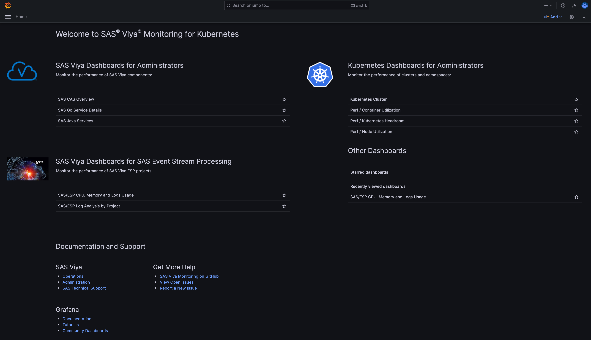
</td></tr></table>

Selecting the **SAS ESP CPU, Memory, and Logs Usage** dashboard shows something similar to this:

<table align="center"><tr><td align="center" width="9999">
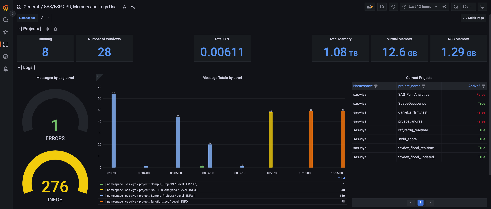
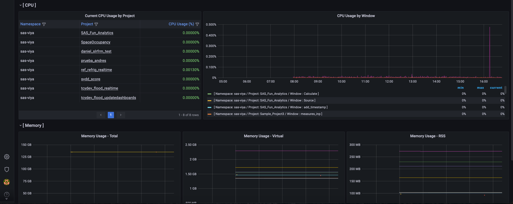
</td></tr></table>

In addition to CPU and memory metrics, the dashboard shows log aggregation information, both summarily and at the
individual project level. The cumulative numbers shown in the **Message Totals by Level** panel apply to all projects
active within the chosen time interval, whereas the **Current Projects** panel gives access to log information only for
currently active projects. Selecting log information displays a screen similar to the following:

<table align="center"><tr><td align="center" width="9999">
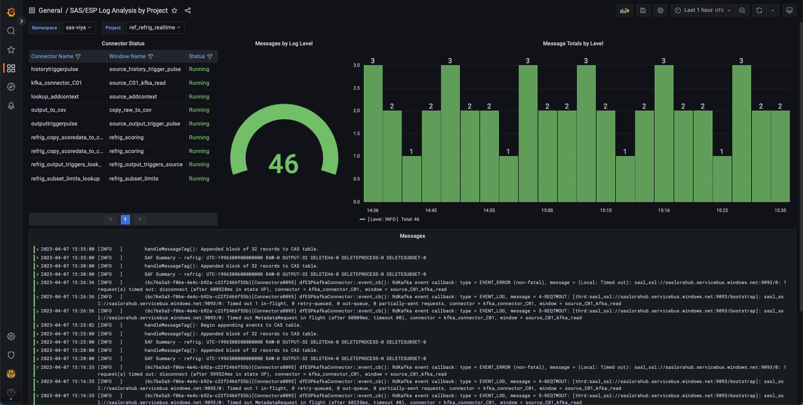
</td></tr></table>

On the **SAS ESP CPU, Memory, and Logs Usage** dashboard, the **Current CPU Usage By Project** panel on the left side of
the screen offers the ability to drill down to the individual pod level to access additional metrics. For example:

<table align="center"><tr><td align="center" width="9999">
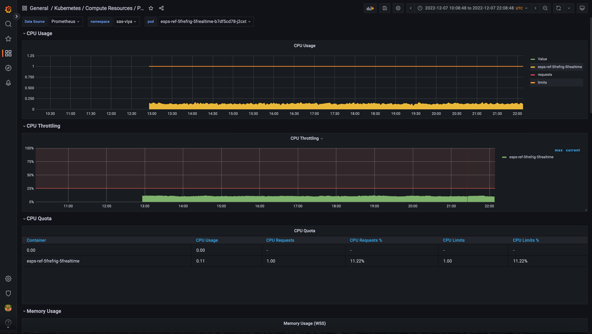
</td></tr></table>

[&#11014;](#top) Top
### Adding Grafana Alert Rules
Custom alert rules can be added to provide the ability to receive notifications when specific behavior happens though different channels, such as Microsoft Teams or custom webhooks. For more information, see [Alert rules](https://grafana.com/docs/grafana/latest/alerting/fundamentals/alert-rules/#:~:text=An%20alert%20rule%20consists%20of,exceed%20to%20create%20an%20alert.) in Grafana documentation.

A list of existing ESP project alert rules can be found in the [esp-project-alert-rules.yaml](https://github.com/sassoftware/iot-kubernetes-monitoring-esp/blob/main/esp-project-alert-rules.yaml) file.

To add alert rules from the provided ESP project alert rules:
1. Navigate to the **Alert rules** section in Grafana:
<table><tr><td>
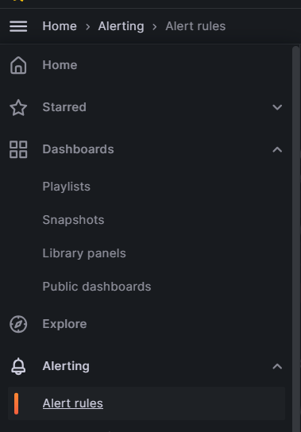
</td></tr></table>

2. Click **New Alert Rule**.
3. Using the provided ESP project alert rules, fill in the fields for the alert rule.

Here is an example for implementing the first alert rule, `ESP Project CPU >80% Threshold`. This alert rule will fire when an ESP project is using more than 80% of the requested CPU limit.

<table align="center"><tr><td align="center" width="9999">
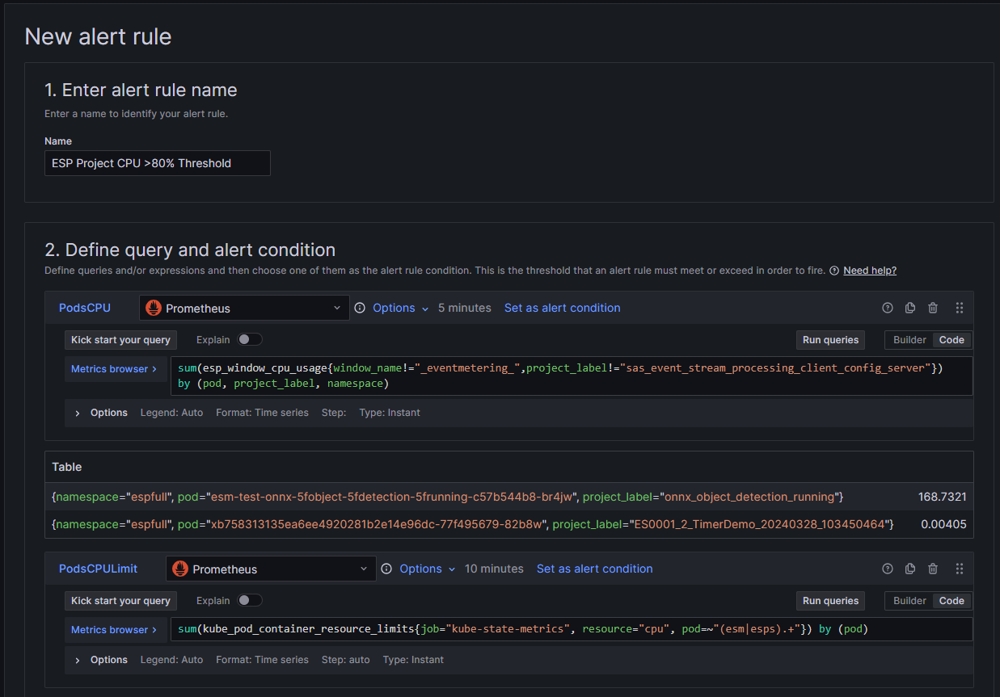
</td></tr></table>

<table align="center"><tr><td align="center" width="9999">
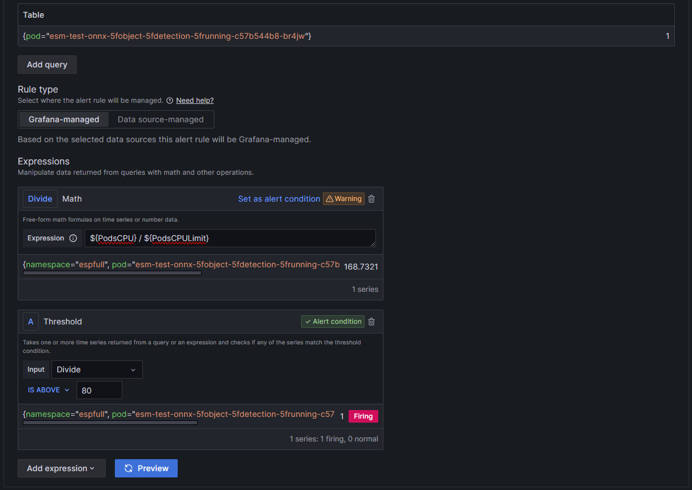
</td></tr></table>

<table align="center"><tr><td align="center" width="9999">
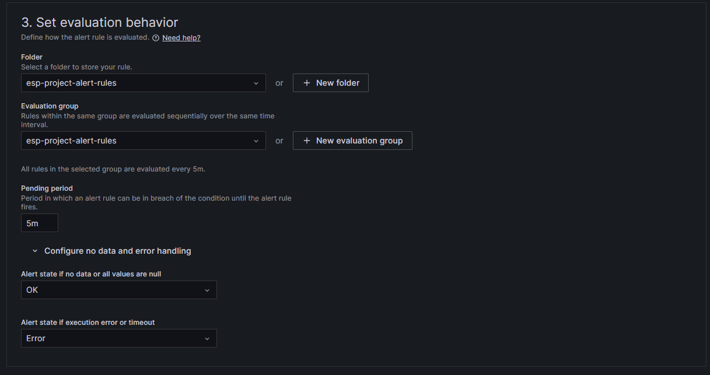
</td></tr></table>

<table align="center"><tr><td align="center" width="9999">
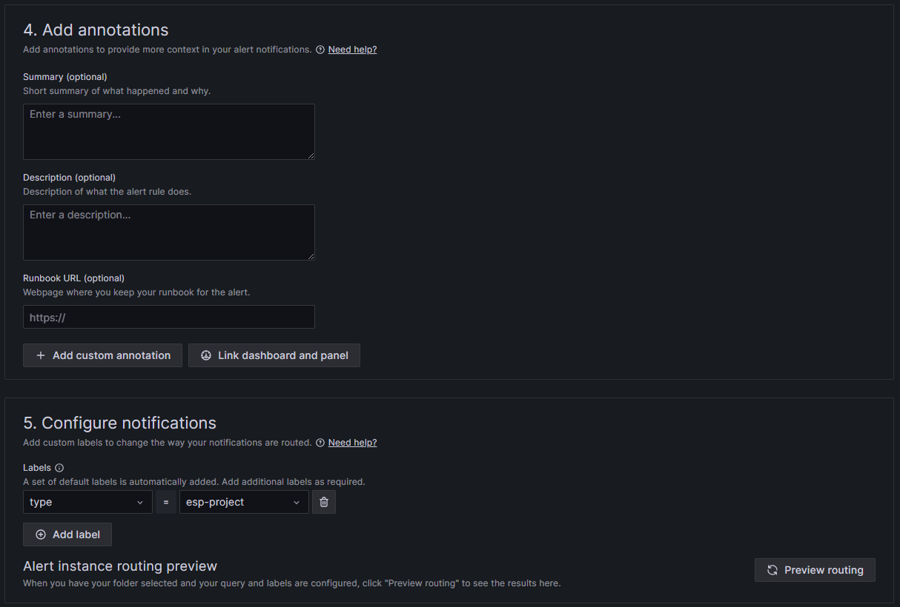
</td></tr></table>

**Note**: It is important to set the **Folder** and **Evaluation group** field to `esp-project-alert-rules` and to set the **Labels** to `type=esp-project` so these rule alerts are displayed on the **ESP Overview** dashboard when the rule alerts are in a firing state. The alert rule template has been left blank for customizing. For more information, see [Notification templating](https://grafana.com/docs/grafana/latest/alerting/fundamentals/alert-rules/message-templating/) and [Labels and annotations](https://grafana.com/docs/grafana/latest/alerting/fundamentals/annotation-label/).

Contact points can be defined to specify where firing alert rules are routed to:

<table><tr><td>
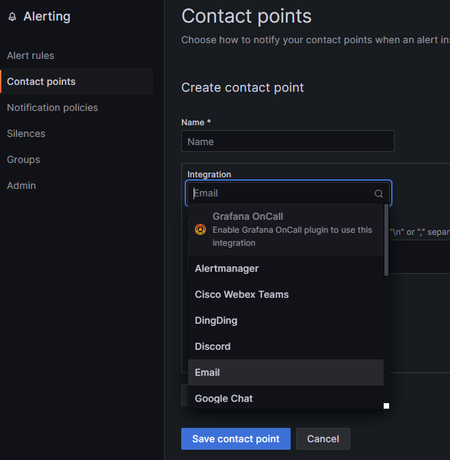
</td></tr></table>

Notification policies can be added so that alert rules with a specific label are always routed to a specific contact point.

[&#11014;](#top) Top
## Uninstalling

Uninstalling SAS Event Stream Processing Monitoring for Kubernetes can be performed using the following command::
```shell
./remove.sh
 ```
   
This removes all Kubernetes resources created during the deployment process from the target cluster.

[&#11014;](#top) Top
## Troubleshooting

For SAS Event Stream Processing Monitoring for Kubernetes to be deployed without errors, the entire list of
prerequisites must be satisfied. Make sure to go through each one of them before attempting to deploy. When the
requirements are in place, in the event that any of the deployment tasks fail, it is recommended to remove the software
before attempting execution again.

To troubleshoot problems with the Kubernetes cluster, it is recommended that you use a tool such as
[Lens](https://k8slens.dev/), or ask someone to help you do the same if you are not familiar with Kubernetes. Finally,
always consult the documentation for SAS Viya Monitoring for Kubernetes before applying any configuration changes that
could lead to deployment errors.

[&#11014;](#top) Top
## Contributing
This project does not accept contributions.

[&#11014;](#top) Top
## License
This project is licensed under the [Apache 2.0 License](LICENSE).

[&#11014;](#top) Top
## Additional Resources

* [SAS Help Center: Monitoring Events, Alerts, and Health with Prometheus](https://go.documentation.sas.com/doc/en/espcdc/default/espex/p012m6yncdn4e3n1wq4rroih16y0.htm#p0rwojd7hnzcymn117e1ilapqgqm )
* [SAS Viya Monitoring for Kubernetes](https://github.com/sassoftware/viya4-monitoring-kubernetes)
* [SAS Event Stream Processing Data Source Plug-in for Grafana](https://github.com/sassoftware/grafana-esp-plugin)
* [Prometheus](https://prometheus.io/)
* [Grafana](https://grafana.com/)
* [Grafana Loki](https://grafana.com/oss/loki/#:~:text=Loki%20is%20a%20horizontally%20scalable,labels%20for%20each%20log%20stream.)
